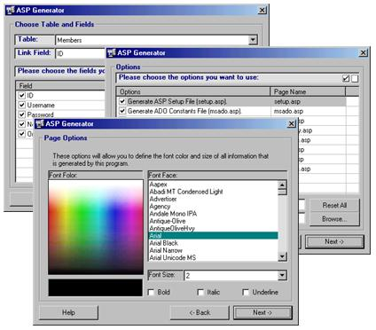



## ASP Code Generator \(essential tools of the web master\)

### Description

This program automatically generates ASP web sites. Full data base support (ADO 2.5) and integrated help file, and a ton of features. This is a professionally written ASP generator that I plan on putting on my Freeware web site. I have seen a few other examples of this sort of thing on PSC, so I thought I would just kill some time and make my own as I have a big ASP web site project coming up in a few days - needless to say this will shave a whole lot of time off of making the database interfaces. If you find this at all useful then please vote.
 
### More Info
 
A database is included in case you need one for testing.

Must have ADO 2.5 installed, it is available on my web site (see included help file).

Creates the ASP code needed to navigate, view, edit, and add recordsets.

None Known

             |
---                |---
**Submitted On**   |2002-03-06 20:31:00
**By**             |[Bryan A\. Cairns](https://github.com/Planet-Source-Code/PSCIndex/blob/master/ByAuthor/bryan-a-cairns.md)
**Level**          |Beginner
**User Rating**    |4.8 (43 globes from 9 users)
**Compatibility**  |VB 6\.0, VB Script, ASP \(Active Server Pages\) , VBA MS Access
**Category**       |[Complete Applications](https://github.com/Planet-Source-Code/PSCIndex/blob/master/ByCategory/complete-applications__1-27.md)
**World**          |[Visual Basic](https://github.com/Planet-Source-Code/PSCIndex/blob/master/ByWorld/visual-basic.md)
**Archive File**   |[ASP\_Code\_G59984362002\.zip](https://github.com/Planet-Source-Code/bryan-a-cairns-asp-code-generator-essential-tools-of-the-web-master__1-32417/archive/master.zip)

### API Declarations

Not too many

